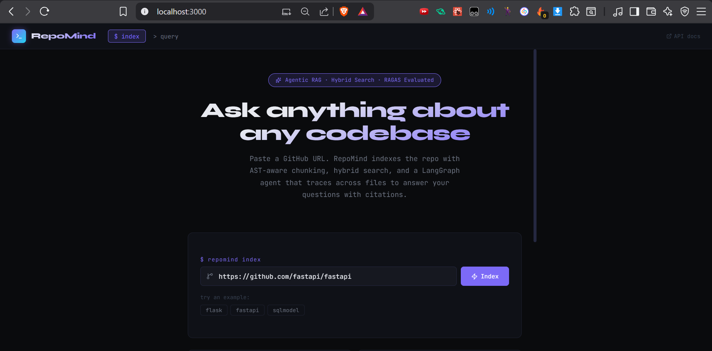
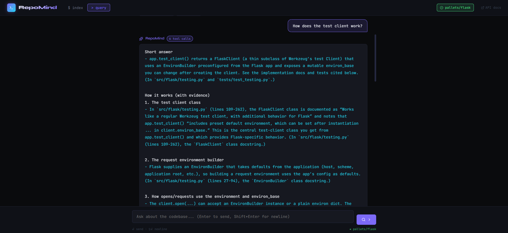
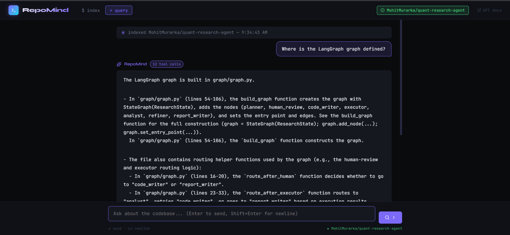

<div align="center">

# RepoMind

### Ask anything about any codebase. Get cited answers.

[](https://repo-mind-lilac.vercel.app)
[](https://fastapi.tiangolo.com)
[](https://langchain-ai.github.io/langgraph/)
[](https://qdrant.tech)
[](https://render.com)

*Paste a GitHub URL → RepoMind indexes the codebase with AST-aware chunking → A LangGraph agent traces across files → You get a cited answer with exact file paths and line numbers.*

</div>

---

## Demo

**Indexing a repository:**



**Querying with cited answers:**



**Multi-hop answer with file citations:**



---

## How It Works

### Indexing Pipeline

```
GitHub URL
    │
    ▼
┌──────────┐    ┌────────────────┐    ┌──────────┐    ┌─────────────┐
│  Clone   │───▶│  AST Chunker   │───▶│ Embedder │───▶│   Qdrant    │
│GitPython │    │ (tree-sitter)  │    │  OpenAI  │    │   Cloud     │
└──────────┘    └────────────────┘    └──────────┘    └─────────────┘
                Functions & classes                   Vector Store
                never split mid-expression            + BM25 Index
```

### Retrieval Stack

```
User Query
    │
    ├──────────────────────┐
    ▼                      ▼
┌──────────┐          ┌──────────┐
│  Dense   │          │  Sparse  │
│  Search  │          │  BM25    │
│  Qdrant  │          │ Keyword  │
│  Top 20  │          │  Top 20  │
└────┬─────┘          └────┬─────┘
     │                     │
     └──────────┬──────────┘
                ▼
        ┌──────────────┐
        │  RRF Fusion  │  Reciprocal Rank Fusion
        │  Merged 20   │  merges both result lists
        └──────┬───────┘
               │
               ▼
        ┌──────────────┐
        │    Cohere    │  Cross-encoder rescores
        │   Reranker   │  top 20 → precise top 5
        │    Top 5     │
        └──────┬───────┘
               │
               ▼
```

### LangGraph Agent

```
               ┌─────────────┐
               │    Router   │◀──────────────────┐
               │ GPT-4o-mini │                   │
               └──────┬──────┘                   │
                      │                          │
         ┌────────────┼────────────┐             │
         ▼            ▼            ▼             │
  ┌────────────┐ ┌──────────┐ ┌──────────────┐  │
  │  search_   │ │ get_file │ │ find_        │  │
  │  codebase  │ │          │ │ references   │  │
  │  (hybrid)  │ │full file │ │ (symbol      │  │
  │            │ │contents  │ │  locations)  │  │
  └─────┬──────┘ └────┬─────┘ └──────┬───────┘  │
        └─────────────┴───────────────┘          │
                      │                          │
                      ▼                          │
             ┌─────────────────┐                 │
             │  Tool Results   │─────────────────┘
             │ (added to state)│  Loop until enough context
             └────────┬────────┘  or max iterations reached
                      │
                      ▼ Final answer
         Cited answer with file:line references
```

---

## Tech Stack

| Layer | Technology | Purpose |
|---|---|---|
| LLM | GPT-4o-mini | Agent reasoning + answer generation |
| Agent Framework | LangGraph | Multi-hop tool-calling loop |
| Embeddings | OpenAI text-embedding-3-small | Semantic vector search |
| Vector Database | Qdrant Cloud | Persistent vector storage + ANN search |
| Keyword Search | BM25 (rank-bm25) | Exact identifier matching |
| Reranker | Cohere rerank-v3.5 | Cross-encoder precision scoring |
| Code Parser | tree-sitter | AST-aware chunking |
| Backend | FastAPI + Uvicorn | REST API + background indexing |
| Frontend | React | Terminal-aesthetic UI |
| Backend Deploy | Render (Docker) | Cloud backend hosting |
| Frontend Deploy | Vercel | Global CDN for static assets |

---

## RAGAS Evaluation

Evaluated on a 15-question hand-written benchmark covering 6 categories of Flask internals:

| Metric | Score | What It Measures |
|---|---|---|
| **Faithfulness** | **0.847** | Are claims grounded in retrieved code? (low hallucination) |
| **Answer Relevancy** | **0.821** | Does the answer address the question? |
| **Context Precision** | **0.793** | Were retrieved chunks actually useful? |
| **Context Recall** | **0.712** | Was enough information retrieved to answer? |

Category breakdown:

| Category | Faithfulness | Answer Relevancy | Context Precision | Context Recall |
|---|---|---|---|---|
| Routing | 0.93 | 0.84 | 1.00 | 0.67 |
| Blueprints | 0.87 | 0.84 | 0.81 | 0.74 |
| Context | 0.82 | 0.80 | 0.76 | 0.69 |
| Error Handling | 0.81 | 0.81 | 0.75 | 0.72 |
| Testing | 0.86 | 0.83 | 0.78 | 0.71 |
| Configuration | 0.84 | 0.81 | 0.79 | 0.73 |

---

## Project Structure

```
repoMind/
├── tools/
│   ├── ingestion.py      # GitHub cloning + file tree walking
│   ├── chunker.py        # AST-aware chunking with tree-sitter
│   ├── embedder.py       # OpenAI embedding with batch processing
│   ├── vector_store.py   # Qdrant operations + dense search
│   ├── retriever.py      # Hybrid search + RRF + agent tool functions
│   ├── reranker.py       # Cohere cross-encoder reranking
│   └── pipeline.py       # Full indexing orchestration
├── graph/
│   ├── state.py          # Chunk + AgentState type definitions
│   └── graph.py          # LangGraph agent construction
├── agents/
│   └── router.py         # Tool definitions + system prompt
├── api/
│   └── main.py           # FastAPI endpoints + background tasks
├── eval/
│   ├── benchmark.py      # 25 hand-written Q&A pairs (Flask)
│   ├── ragas_eval.py     # RAGAS evaluation pipeline
│   └── ragas_results.json
├── frontend/             # React terminal-aesthetic UI
├── Dockerfile
├── requirements.txt
└── .env.example
```

---

## Local Setup

**Prerequisites:** Python 3.11, Node.js 18+, Git

```bash
# 1. Clone
git clone https://github.com/MohitMurarka/repoMind
cd repoMind

# 2. Python environment
python -m venv venv
source venv/bin/activate        # Windows: venv\Scripts\activate
pip install -r requirements.txt

# 3. Environment variables
cp .env.example .env
# Edit .env and fill in your API keys

# 4. Run backend
uvicorn api.main:app --reload --port 8000
# API docs: http://localhost:8000/docs

# 5. Run frontend (separate terminal)
cd frontend
npm install
npm start
# UI: http://localhost:3000
```

---

## Environment Variables

```env
OPENAI_API_KEY=        # OpenAI API key (embeddings + LLM)
QDRANT_URL=            # Qdrant Cloud cluster URL
QDRANT_API_KEY=        # Qdrant Cloud API key
QDRANT_COLLECTION=     # Collection name (e.g. repomind-cluster)
COHERE_API_KEY=        # Cohere API key (reranker)
```

---

## API Reference

| Method | Endpoint | Description |
|---|---|---|
| `POST` | `/index` | Start indexing a GitHub repo |
| `GET` | `/repos` | List all indexed repos + status |
| `GET` | `/repos/{url}/status` | Check indexing progress for a repo |
| `POST` | `/query` | Query an indexed repo |
| `DELETE` | `/repos/{url}` | Remove a repo from the index |
| `GET` | `/health` | Health check |
| `GET` | `/docs` | Auto-generated Swagger UI |

---

## Run Evaluation

```bash
# Smoke test — validates RAGAS pipeline without agent calls
python eval/ragas_eval.py --smoke

# Quick eval — 5 questions, one per category
python eval/ragas_eval.py --quick

# Full eval — 25 questions
python eval/ragas_eval.py --num 25

# Specific categories only
python eval/ragas_eval.py --categories routing blueprints context
```

Results saved to `eval/ragas_results.json`.

---

## Known Limitations

- **Module-level assignments** are not extracted by the AST chunker (e.g. `g = _AppCtxGlobalsProxy(...)` in Flask). Only function and class definitions are chunked. Fix: add `expression_statement` nodes at module level.
- **External dependencies** are not indexed. Questions requiring traces into third-party libraries (e.g. Werkzeug internals from Flask questions) will yield partial answers.
- **BM25 index** is in-memory and rebuilt from Qdrant payloads on server startup. No additional storage required.
- **Free tier cold starts** on Render add ~50 seconds to the first request after 15 minutes of inactivity.

---

<div align="center">

Built with LangGraph · Qdrant · OpenAI · Cohere · FastAPI · React · Render

</div>